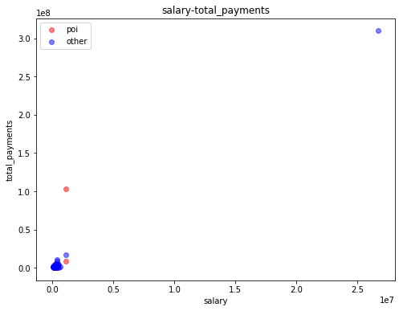
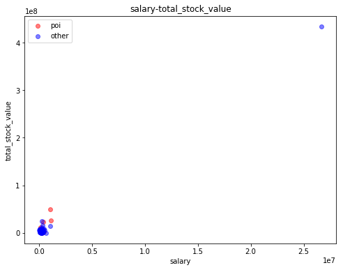
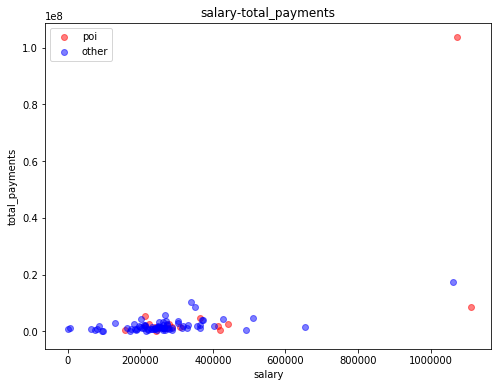
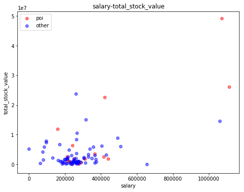

# 从安然公司邮件中发现欺诈证据

***

在这次的项目中，我们的分析对象是公开的安然公司的邮件信息。借助机器学习的相关算法，我们要从中识别出欺诈案的嫌疑人。在这份报告中，不仅会给出识别结果，还会对分析过程中算法的选择、指标等进行描述。

***

数据导入：初始导入数据后，是字典格式的，为了后续分析方便我们将其转换为DataFrame格式。


```python
import pickle
import pandas as py

# 加载原始数据
with open("final_project_dataset.pkl", "rb") as data_file:
    data_dict = pickle.load(data_file)
    
data = []

# 将字典的key转换为整个数据的字段之一
for item in data_dict:
    data_dict[item]['name'] = item
    data.append(data_dict[item])
    
# 转换为DataFrame格式
df_email = py.DataFrame(data)
```

***

## 数据探索和异常值调查

得到了DataFrame格式的数据，首先我们可以看到总的数据数量为146条，有22个字段。接下来我们可以逐字段的进行分析。首先我希望搞清楚的是，每个字段都属于什么类型，是数值、类别、文本、日期，或是其他什么。经过观察得到的结论如下表：

| 数值 numeric | 类别 category | 日期 date | 文本 text | 其他 other |
| - | - | - | - | -: | 
| bonus | email_address | | | |
| deferral_payments | name | | | |
| deferred_income | poi | | | |
| director_fees | | | | |
| exercised_stock_options | | | | |
| expenses | | | | |
| from_messages | | | | |
| from_poi_to_this_person | | | | |
| from_this_person_to_poi | | | | |
| loan_advances | | | | |
| long_term_incentive | | | | |
| other | | | | |
| restricted_stock | | | | |
| restricted_stock_deferred | | | | |
| salary | | | | |
| shared_receipt_with_poi | | | | |
| to_messages | | | | |
| total_payments | | | | |
| total_stock_value | | | | |

可以看到绝大部分数据都是数值类型。这里email_address和name虽然也可以看作文本，但我觉得这两个字段都可以标识出一个独立的人的实体，因此这里划分到了类别类型中。

类型区分完成后，开始观察具体的数据值。很快我们就发现了一个问题，数据中存在大量标记为“NaN”的缺失值。通过df_email.describe()观察可以看到，除了name和poi两个字段之外，其他字段均存在NaN值，而且有些字段中的NaN值数量比例相当高。


```python
df_email.describe()
```


<div>
<style scoped>
    .dataframe tbody tr th:only-of-type {
        vertical-align: middle;
    }

    .dataframe tbody tr th {
        vertical-align: top;
    }

    .dataframe thead th {
        text-align: right;
    }
</style>
<table border="1" class="dataframe">
  <thead>
    <tr style="text-align: right;">
      <th></th>
      <th>bonus</th>
      <th>deferral_payments</th>
      <th>deferred_income</th>
      <th>director_fees</th>
      <th>email_address</th>
      <th>exercised_stock_options</th>
      <th>expenses</th>
      <th>from_messages</th>
      <th>from_poi_to_this_person</th>
      <th>from_this_person_to_poi</th>
      <th>...</th>
      <th>name</th>
      <th>other</th>
      <th>poi</th>
      <th>restricted_stock</th>
      <th>restricted_stock_deferred</th>
      <th>salary</th>
      <th>shared_receipt_with_poi</th>
      <th>to_messages</th>
      <th>total_payments</th>
      <th>total_stock_value</th>
    </tr>
  </thead>
  <tbody>
    <tr>
      <th>count</th>
      <td>146</td>
      <td>146</td>
      <td>146</td>
      <td>146</td>
      <td>146</td>
      <td>146</td>
      <td>146</td>
      <td>146</td>
      <td>146</td>
      <td>146</td>
      <td>...</td>
      <td>146</td>
      <td>146</td>
      <td>146</td>
      <td>146</td>
      <td>146</td>
      <td>146</td>
      <td>146</td>
      <td>146</td>
      <td>146</td>
      <td>146</td>
    </tr>
    <tr>
      <th>unique</th>
      <td>42</td>
      <td>40</td>
      <td>45</td>
      <td>18</td>
      <td>112</td>
      <td>102</td>
      <td>95</td>
      <td>65</td>
      <td>58</td>
      <td>42</td>
      <td>...</td>
      <td>146</td>
      <td>93</td>
      <td>2</td>
      <td>98</td>
      <td>19</td>
      <td>95</td>
      <td>84</td>
      <td>87</td>
      <td>126</td>
      <td>125</td>
    </tr>
    <tr>
      <th>top</th>
      <td>NaN</td>
      <td>NaN</td>
      <td>NaN</td>
      <td>NaN</td>
      <td>NaN</td>
      <td>NaN</td>
      <td>NaN</td>
      <td>NaN</td>
      <td>NaN</td>
      <td>NaN</td>
      <td>...</td>
      <td>MCDONALD REBECCA</td>
      <td>NaN</td>
      <td>False</td>
      <td>NaN</td>
      <td>NaN</td>
      <td>NaN</td>
      <td>NaN</td>
      <td>NaN</td>
      <td>NaN</td>
      <td>NaN</td>
    </tr>
    <tr>
      <th>freq</th>
      <td>64</td>
      <td>107</td>
      <td>97</td>
      <td>129</td>
      <td>35</td>
      <td>44</td>
      <td>51</td>
      <td>60</td>
      <td>60</td>
      <td>60</td>
      <td>...</td>
      <td>1</td>
      <td>53</td>
      <td>128</td>
      <td>36</td>
      <td>128</td>
      <td>51</td>
      <td>60</td>
      <td>60</td>
      <td>21</td>
      <td>20</td>
    </tr>
  </tbody>
</table>
<p>4 rows × 22 columns</p>
</div>


对于数值型的某些字段，例如奖金、股票、某些邮件的收发数量等，NaN值可以理解为数量为0，但我们也不能确定排除是其他原因造成的缺失。对于另一些数值类型，例如工资，我们可以确定这一值的缺失一定不代表是0。因此这里我们还不能贸然将所有NaN值进行替换。

对于email_address字段，经观察，我们发现其格式似乎都是“firstname.lastname@enron.com”的格式，而name列的格式为“LASTNAME FIRSTNAME M”，因此email_address字段的缺失值是可以通过对name字段进行变换予以补齐的。

再来观察数值类型的字段，大致可以分为两类，一类与收入金额相关，例如工资、股票等等。另一类是沟通交流类，如邮件的收发数量等。我们知道，安然欺诈案的手法是，嫌疑人通过虚假交易等手段抬升公司股价，从中获利。因此从直觉判断，嫌疑人的收入信息，和沟通交流信息，理应存在与其他人不同的情况，这可能会在我们的数据中表现为**异常值**。当然也不排除其他的例如操作错误等原因造成异常值的出现，接下来我们对这部分数据进行一下详细分析。

首先对于收入类的数据，我想用salary作为基础参照值。因为公司中每个员工的职位不同，可能会带来各种收入上的差异，而工资应该能基本反映出职位的不同。
所以首先我对salary和total_payments以及total_stock_value的关系做了散点图的观察。


```python
import matplotlib.pyplot as plt 

#工资-总薪酬关系图
plt.figure(figsize = (8,6))
df_poi = df_email.where(df_email.poi == True)
df_other = df_email.where(df_email.poi == False)
plt.scatter(df_poi.salary, df_poi.total_payments, alpha = 0.5, c = 'r',label='poi')
plt.scatter(df_other.salary, df_other.total_payments, alpha = 0.5, c = 'b',label='other')
plt.title('salary-total_payments')
plt.xlabel('salary')
plt.ylabel('total_payments')
plt.legend()
plt.show()
```





```python
plt.figure(figsize = (8,6))
df_poi = df_email.where(df_email.poi == True)
df_other = df_email.where(df_email.poi == False)
plt.scatter(df_poi.salary, df_poi.total_stock_value, alpha = 0.5, c = 'r',label='poi')
plt.scatter(df_other.salary, df_other.total_stock_value, alpha = 0.5, c = 'b',label='other')
plt.title('salary-total_stock_value')
plt.xlabel('salary')
plt.ylabel('total_stock_value')
plt.legend()
plt.show()
```





两个图的右上角都出现了一个远远离开大家的点，说明此人拥有超高的工资、总报酬和持股。在我们的数据表中查看，发现name竟然是“TOTAL”。看来这个点是个明显的，错误纳入统计的异常值了，因为对数据的总计对我们识别嫌疑人并没有什么直接帮助。

排除此点之后再来观察：


```python
df_email_without_total = df_email.drop(df_email[(df_email.name == 'TOTAL')].index.tolist())

plt.figure(figsize = (8,6))
df_poi = df_email_without_total.where(df_email_without_total.poi == True)
df_other = df_email_without_total.where(df_email_without_total.poi == False)
plt.scatter(df_poi.salary, df_poi.total_payments, alpha = 0.5, c = 'r',label='poi')
plt.scatter(df_other.salary, df_other.total_payments, alpha = 0.5, c = 'b',label='other')
plt.title('salary-total_payments')
plt.xlabel('salary')
plt.ylabel('total_payments')
plt.legend()
plt.show()
```





```python
plt.figure(figsize = (8,6))
df_poi = df_email_without_total.where(df_email_without_total.poi == True)
df_other = df_email_without_total.where(df_email_without_total.poi == False)
plt.scatter(df_poi.salary, df_poi.total_stock_value, alpha = 0.5, c = 'r',label='poi')
plt.scatter(df_other.salary, df_other.total_stock_value, alpha = 0.5, c = 'b',label='other')
plt.title('salary-total_stock_value')
plt.xlabel('salary')
plt.ylabel('total_stock_value')
plt.legend()
plt.show()
```





处理后的数据仍存在一些离群点，但仔细观察可以发现，这些离群点的数值也都是合理的，尤其是股票信息中的几个离群点，嫌疑人信息为True，相当符合安然案中操纵股价获利的事实。因此这些数据我们可以认为应当保留以作为分析的支撑。

***

## 创建新特征 | 特征缩放 | 特征选择

根据在探索过程中对异常值的分析，我现在直觉上认为股票收入能够反映出嫌疑人利用操纵股价获利的事实，表现为股票收入在总收入中的比例较高，因此第一个**新特征**我选择使用$stock\_ratio = \frac{total\_stock\_value}{total\_stock\_value + total\_payments}$

另外我们还假定了嫌疑人之间的联络会较为频繁，因此还有两个新特征可以选择：
$$
from\_ratio = \frac{from\_this\_person\_to\_poi}{from\_messages}
$$

$$
to\_ratio = \frac{from\_poi\_to\_this\_person}{to\_messages}$$


```python
def get_ratio(payments, stock):
    if str(payments) == 'NaN':
        payments = 0
    if str(stock) == 'NaN':
        stock = 0
    if stock == 0 and payments == 0:
        return 0
    else:
        return float(stock)/float(stock + payments)
    
def get_message_ratio(poi_messages, messages):
    if str(messages) == 'NaN' or str(poi_messages) == 'NaN':
        return 0
    return float(poi_messages)/float(messages)
    
df_email_without_total['stock_ratio'] = df_email_without_total.apply(lambda row:get_ratio(row['total_payments'], row['total_stock_value']), axis=1)

df_email_without_total['from_ratio'] = df_email_without_total.apply(lambda row: get_message_ratio(row['from_this_person_to_poi'], row['from_messages']), axis=1)
df_email_without_total['to_ratio'] = df_email_without_total.apply(lambda row: get_message_ratio(row['from_poi_to_this_person'], row['to_messages']), axis=1)
```


需要注意的是，我们这样处理后，产生的新特征的取值范围是0~1，这与原有的其他特征的取值范围差距很大。为了保证算法的准确性，我们需要对其进行区间缩放。


```python
from sklearn.preprocessing import MinMaxScaler

df_features = df_email_without_total.drop(['name', 'email_address', 'poi'],axis = 1)

def replace_NaN(value):
    if str(value) == 'NaN' or str(value) == 'nan':
        value = 0
    return value;

for col in df_features.columns:
    df_features[col] = df_features.apply(lambda row: replace_NaN(row[col]), axis = 1)

df_features_scaled = MinMaxScaler().fit_transform(df_features)
```

目前我们已经有了22项特征，为了减少过拟合，提高预测的准确度，我们从中选取若干特征即可。这里采用了SelectKBest算法，取10项特征。


```python
from sklearn.feature_selection import SelectKBest
from sklearn.feature_selection import chi2

selector=SelectKBest(score_func=chi2, k=10)
selector.fit(df_features_scaled,df_email_without_total.poi)

result = []
for i in range(0,len(df_features.columns)):
    result.append((df_features.columns[i],selector.scores_[i]));

print(sorted(result,key=lambda x:(x[1], x[0]), reverse = True))
```

    [('exercised_stock_options', 7.009497551677271), ('loan_advances', 6.79671350017675), ('total_stock_value', 5.613110600696533), ('bonus', 5.2660394713253424), ('from_ratio', 4.791466545616086), ('salary', 3.180748085514779), ('total_payments', 2.8438536260277716), ('long_term_incentive', 2.6209783250663286), ('shared_receipt_with_poi', 2.5325815335552035), ('other', 1.7326908520849467), ('expenses', 1.5654589113307582), ('director_fees', 1.477490997632723), ('from_poi_to_this_person', 1.4270738515867432), ('from_this_person_to_poi', 1.0385276327820532), ('to_ratio', 0.8749004724280599), ('restricted_stock', 0.6012947115835049), ('to_messages', 0.46596266527660346), ('deferred_income', 0.34333154247536946), ('from_messages', 0.06436091561007537), ('deferral_payments', 0.05648529321259907), ('restricted_stock_deferred', 0.003405798842138222), ('stock_ratio', 0.003072474400591968)]
    

整理后的排名格式：

1. ('exercised_stock_options', 7.009497551677271),
2. ('loan_advances', 6.79671350017675), 
3. ('total_stock_value', 5.613110600696533), 
4. ('bonus', 5.2660394713253424), 
5. ('from_ratio', 4.791466545616086), 
6. ('salary', 3.180748085514779), 
7. ('total_payments', 2.8438536260277716), 
8. ('long_term_incentive', 2.6209783250663286), 
9. ('shared_receipt_with_poi', 2.5325815335552035), 
10. ('other', 1.7326908520849467), 
11. ('expenses', 1.5654589113307582), 
12. ('director_fees', 1.477490997632723), 
13. ('from_poi_to_this_person', 1.4270738515867432), 
14. ('from_this_person_to_poi', 1.0385276327820532), 
15. ('to_ratio', 0.8749004724280599), 
16. ('restricted_stock', 0.6012947115835049), 
17. ('to_messages', 0.46596266527660346), 
18. ('deferred_income', 0.34333154247536946), 
19. ('from_messages', 0.06436091561007537), 
20. ('deferral_payments', 0.05648529321259907), 
21. ('restricted_stock_deferred', 0.003405798842138222), 
22. ('stock_ratio', 0.003072474400591968)

这里发现我们自己创建的特征，有两个排名都很低。只有from_ratio符合了特征选择的标准。

***

## 选择算法


这里我选择了使用决策树和朴素贝叶斯来进行分析。需要注意的是，我们之前进行了特征取值范围的缩放，有些算法会受到影响。

首先要对特征值和'poi'标签进行划分：


```python
selected_features = selector.transform(df_features_scaled)

from sklearn import cross_validation

features_train, features_test, labels_train, labels_test = cross_validation.train_test_split(selected_features, df_email_without_total.poi, test_size=0.3, random_state=42)
```

接下来分别用两种算法来进行训练和测试：


```python
from sklearn.tree import DecisionTreeClassifier

tree = DecisionTreeClassifier()
tree.fit(features_train,labels_train)
print(tree.score(features_test,labels_test))
```

    0.8636363636363636
    


```python
from sklearn.naive_bayes import GaussianNB

nb = GaussianNB();
nb.fit(features_train,labels_train)
print(nb.score(features_test,labels_test))
```

    0.9090909090909091
    

可以看到，在全部采用默认参数的情况下，我们的两个模型的准确率已经能达到86.3%和90.9%，可以说我们迄今为止的工作已经初见成效。接下来我将对算法进行调整，以求得最佳的算法性能。

***

## 调整算法

所谓算法的调整，指的其实是在分析前我们人为设置的一些参数的调整。这些参数往往代表着模型的复杂度、计算能力等与模型业务无关的固有属性。随着采用模型的不同，不同参数下得到的结果也会有各种性能上的差异。下面就引入GridSearchCV对我们的决策树算法进行参数调整，尝试得到最佳参数组合。


```python
from sklearn.model_selection import GridSearchCV

params = {'criterion':('gini', 'entropy'),'splitter':('best', 'random'), 'max_depth':[1, 5, 10, 100, None], 
          'min_samples_split':[2,4,8],'min_samples_leaf':[1,2,3,4],'min_weight_fraction_leaf':[0,0.1,0.25,0.5],
          'max_features':(None,'auto','sqrt','log2'),'max_leaf_nodes':[None,2,4,8],'class_weight':('balanced', None),
          'presort':(True, False)}

clf = GridSearchCV(tree, params)
clf.fit(selected_features, df_email_without_total.poi)
print(clf.best_params_, clf.best_score_)
```

    {'class_weight': None, 'criterion': 'entropy', 'max_depth': None, 'max_features': 'auto', 'max_leaf_nodes': 8, 'min_samples_leaf': 1, 'min_samples_split': 8, 'min_weight_fraction_leaf': 0, 'presort': False, 'splitter': 'random'} 0.9103448275862069
    

我们这里没有选择调整全部的参数，选择用来测试的参数有：
* criterion 取值为'gini'或'entropy'
* splitter 取值为'best' 或 'radom'
* max_depth 取值1、5、10、100和默认的None
* min_samples_split 取2、4、8
* min_samples_leaf 取1、2、3、4
* min_weight_fraction_leaf 取0、0.1、0.25、0.5
* max_features 取 None、'auto'、'sqrt'或'log2'
* max_leaf_nodes 取 None、2、4、8
* class_weight 取值'balanced'或None
* presort 取值True 或 False

给出的最佳参数设置结果是：
* class_weight: None, 
* criterion: 'entropy',
* max_depth: None,
* max_features: 'auto',
* max_leaf_nodes: 8, 
* min_samples_leaf: 1, 
* min_samples_split: 8,
* min_weight_fraction_leaf: 0,
* presort: False, 
* splitter: 'random'


```python
tree = DecisionTreeClassifier(class_weight = None, 
                              criterion = 'entropy',
                              max_depth = None,
                              max_features = 'auto',
                              max_leaf_nodes = 8,
                              min_samples_leaf = 1,
                              min_samples_split = 8,
                              min_weight_fraction_leaf = 0,
                              presort = False,
                              splitter = 'random')
tree.fit(features_train,labels_train)
print(tree.score(features_test,labels_test))
```

    0.9545454545454546
    

我们用这个参数带入决策树测试代码再次运行，得到的准确率是95.45%，比默认参数提升了7个百分点。可见参数调整在机器学习方法中的重要性。

***

## 验证&评估

最后，我们来对最终选定的决策树算法及其参数进行一下系统的验证和评估。

事实上，我们在算法调整过的过程中已经采取了sklearn库中的cross_validation进行交叉验证。我们划分了70%的数据作为训练集，30%的数据作为测试集。相比全部数据都用来训练，这一策略减少了过拟合现象。

我们直接使用了项目中的tester.py来对算法进行评估。在tester.py中，使用了StratifiedShuffleSplit来进行数据划分。StratifiedShuffleSplit是结合了StratifiedKFold和ShuffleSplit的一种算法，将我们的数据进行了若干次（tester.py中是1000次）有放回的分组，并保证了每次分组中poi数据比例是相同的。在我的测试中，观察到每次都会为训练组划分128条数据，测试组15条；训练组中有16个poi,测试组中2个。

这种验证方式的好处，我认为首先是可以为有限的数据创建足够多的测试实例，当然其中应该有重复的情况。在我们的例子中是为140+条数据创建了1000次验证。其次保证了分组中的分类数据的比例，这减少了每次验证时，极端的数据分配情况产生的不确定因素，验证结果相对更加公正。因此针对我们这次项目中的145条数据，StratifiedShuffleSplit方法是一个不错的选择。

最终得到的结果如下：

```
DecisionTreeClassifier(class_weight=None, criterion='entropy', max_depth=None,
            max_features='auto', max_leaf_nodes=8,
            min_impurity_decrease=0.0, min_impurity_split=None,
            min_samples_leaf=1, min_samples_split=8,
            min_weight_fraction_leaf=0, presort=False, random_state=None,
            splitter='random')
Accuracy: 0.85880       Precision: 0.39757      Recall: 0.11450 F1: 0.17780     F2: 0.13351
Total predictions: 15000        True positives:  229    False positives:  347   False negatives: 1771   True negatives: 12653

```
从中我们提取几个比较关心的指标：
* 准确率 Accuracy: 0.85880, 说明我们这个算法对是否是poi，分辨正确的概率为85.88%左右
* 精确度 Precision: 0.39757， 表示我们的算法判定为poi的人中约有39.75%确实是poi
* 召回率  Recall: 0.11450, 表示我们的算法识别出的poi，仅占全部poi的11.45%左右，这一指标就非常惨了。

由于召回率过于低下，我不得不回过头重新进行了参数的调整和反复的验证。最终得到一组参数及其评估结果为：
```
DecisionTreeClassifier(class_weight='balanced', criterion='gini', max_depth=4,
            max_features='auto', max_leaf_nodes=8,
            min_impurity_decrease=0.0, min_impurity_split=None,
            min_samples_leaf=2, min_samples_split=4,
            min_weight_fraction_leaf=0, presort=True, random_state=None,
            splitter='best')
Accuracy: 0.78280       Precision: 0.32576      Recall: 0.58800 F1: 0.41925     F2: 0.50646
Total predictions: 15000        True positives: 1176    False positives: 2434   False negatives:  824   True negatives: 10566
```
在使用这组参数的情况下，我们的算法在**准确度**和**精确度**上都有所下降，**召回率**则有了显著的提升。综合判断下来，我认为使用调整后的这组参数的决策树算法，在准确度的损失可接受的范围内，达到了精确度和召回率的性能要求。
